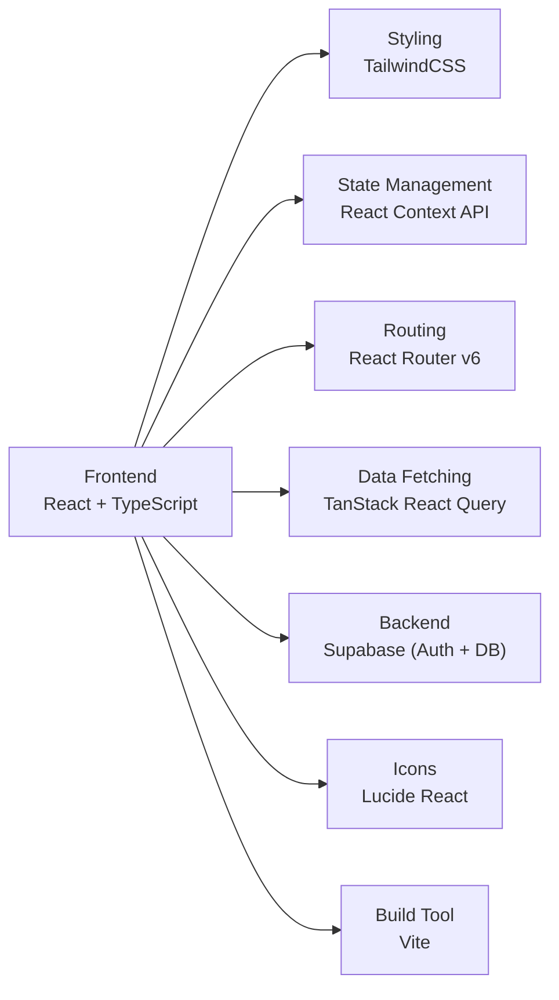
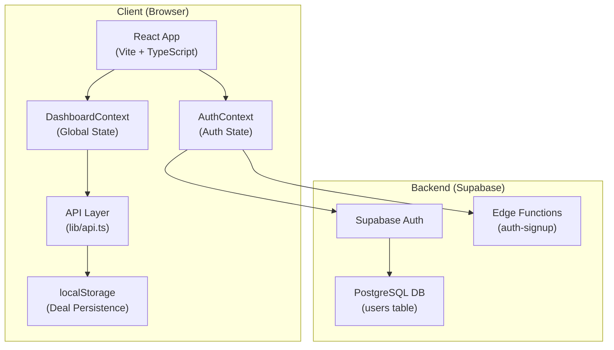
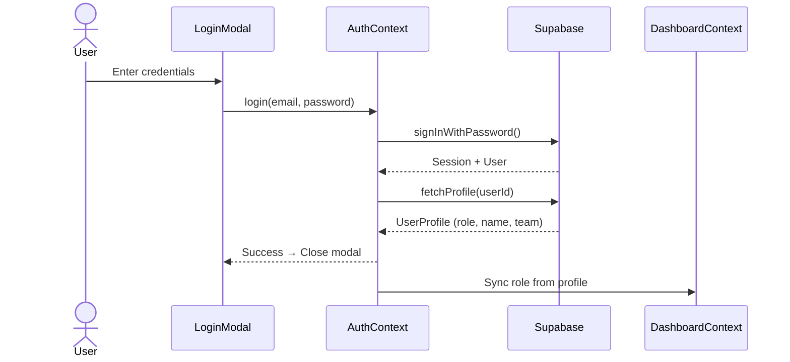
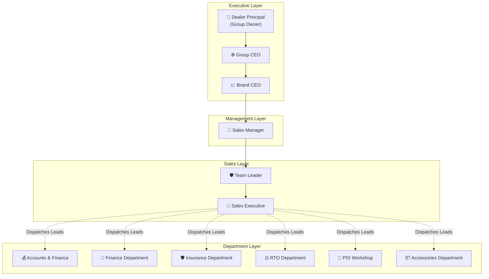
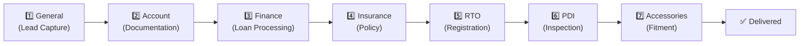
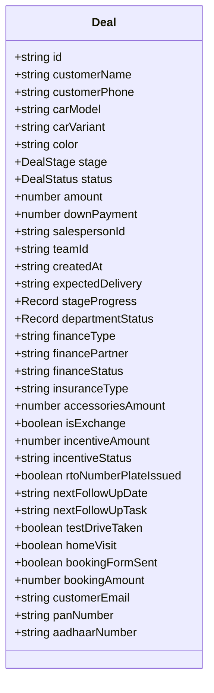
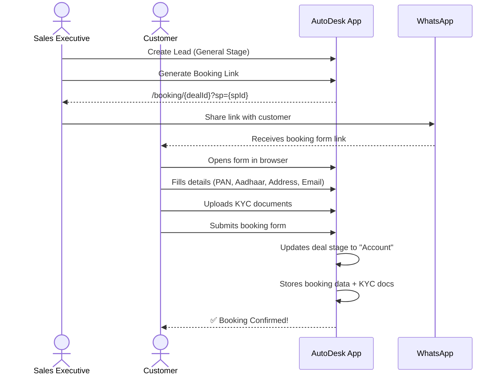
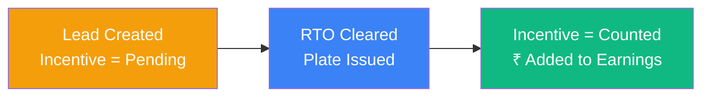
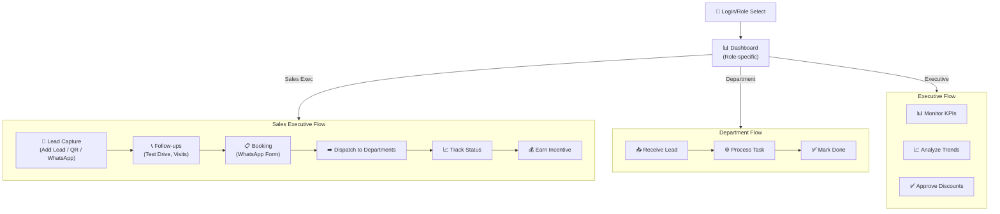

# 🚗 AutoDesk — Car Dealership Management System
## Complete Project Flow & Presentation Guide

---

## 📌 Slide 1: Project Overview

**Project Name:** AutoDesk — Sales Management System  
**Industry:** Automobile Dealership (Multi-Brand, Multi-Outlet)  
**Type:** Full-stack Web Application (React + Supabase)  
**Purpose:** End-to-end car sales lifecycle management — from lead capture to vehicle delivery — with role-based dashboards for every department.

### Key Highlights
| Feature | Detail |
|---|---|
| **Total User Roles** | 12 distinct roles |
| **Deal Pipeline Stages** | 7 stages (General → Accessories) |
| **Car Brands Supported** | 5 (TATA, Hyundai, Toyota, Mahindra, Maruti) |
| **Outlets/Teams** | 20 teams across 5 cities |
| **Total Dashboard Views** | 60+ unique views/pages |
| **Authentication** | Supabase Auth (Email/Password + Demo Login) |

---

## 📌 Slide 2: Tech Stack



| Layer | Technology |
|---|---|
| **Frontend Framework** | React 18 + TypeScript |
| **Styling** | TailwindCSS |
| **State Management** | React Context API (`DashboardContext`, `AuthContext`, `AppContext`) |
| **Routing** | React Router v6 (SPA) |
| **Backend / BaaS** | Supabase (Authentication, Database, Edge Functions) |
| **Data Layer** | Mock API with `localStorage` persistence + Supabase integration |
| **UI Components** | Custom components + shadcn/ui primitives |
| **Icons** | Lucide React |
| **Build Tool** | Vite |
| **Package Manager** | npm |

---

## 📌 Slide 3: System Architecture



### Data Flow
1. **App boots** → `AuthContext` checks Supabase session → fetches user profile from `users` table
2. **DashboardContext** loads deals, salespeople, teams, activities, notifications via mock API
3. **Mock API** reads/writes deals to `localStorage` (simulating database persistence)
4. **Role switching** available via Header dropdown — instantly changes sidebar + dashboard view

---

## 📌 Slide 4: Authentication System

### Login Flow


### Features
- **Supabase Auth** with email/password
- **Sign Up** via Edge Function (`auth-signup`) — creates user + profile in one step
- **Role Selection** during signup (Sales Executive, Team Leader, Sales Manager)
- **Demo Login** — 3 pre-configured accounts for quick access
- **Multi-Role Switcher** — Header dropdown allows switching between all 12 roles (for demo/presentation purposes)
- **Live Status Indicator** — Green "Live" badge when authenticated

---

## 📌 Slide 5: The 12 User Roles



| # | Role | Key Responsibility |
|---|---|---|
| 1 | **Sales Executive** | Lead capture, follow-ups, deal creation, customer interaction |
| 2 | **Team Leader** | Monitors their team's performance, pipeline, and targets |
| 3 | **Sales Manager** | Aggregate view of ALL teams, targets, and revenue |
| 4 | **Accounts & Finance** | Sales invoicing, showroom expenses, stock inventory |
| 5 | **RTO Department** | Vehicle registration, tax challans, HSRP tracking, documents |
| 6 | **Insurance Department** | Policy issuance, premium calculation, renewals, claims |
| 7 | **Accessories Department** | Fitment queue, inventory, combo packages, procurement |
| 8 | **Finance Department** | Loan applications, bank schemes, payout tracker, NOC closure |
| 9 | **PDI Workshop** | Pre-delivery inspection queue, 100-point checklist, rectification |
| 10 | **Brand CEO** | Executive summary, inventory valuation, department throughput |
| 11 | **Group CEO** | Consolidated multi-brand view, fund flow, HR & payroll, compliance |
| 12 | **Dealer Principal (Owner)** | Command center, profitability analytics, delivery funnel, CSAT |

---

## 📌 Slide 6: The 7-Stage Deal Pipeline



### Parallel Departmental Routing
> [!IMPORTANT]
> The system uses a **parallel dispatch** model — not a strict linear pipeline. Sales executives can send leads to multiple departments simultaneously.

| Stage | Color | Department Owner | What Happens |
|---|---|---|---|
| **General** | `#94a3b8` (Gray) | Sales Executive | Lead is captured, follow-ups begin |
| **Account** | `#3b82f6` (Blue) | Accounts Dept | KYC documents, booking amount collected |
| **Finance** | `#8b5cf6` (Purple) | Finance Dept | Loan application, bank approval, disbursement |
| **Insurance** | `#ec4899` (Pink) | Insurance Dept | Policy issuance, premium calculation |
| **RTO** | `#f59e0b` (Amber) | RTO Dept | Vehicle registration, number plate, HSRP |
| **PDI** | `#10b981` (Green) | PDI Workshop | 100-point inspection, rectification |
| **Accessories** | `#ff6b35` (Orange) | Accessories Dept | Fitment, combo packages, delivery prep |

### Department Status Tracking
Each deal tracks per-department status independently:
- `Not Sent` → Department hasn't received the lead
- `In Progress` → Department is working on it
- `Completed` → Department has finished their task

---

## 📌 Slide 7: Sidebar Navigation (Per Role)

### Sales Roles (Executive, Team Leader, Sales Manager)
| Menu Item | View | Description |
|---|---|---|
| Today Tasks | `today_tasks` | Daily follow-ups & action items *(Sales Exec only)* |
| Dashboard | `dashboard` | Role-specific main dashboard |
| Leads | `deals` | Lead listing with search & filters |
| Pipeline | `pipeline` | Visual pipeline with drag-and-drop |
| Team | `team` | Team member cards & performance *(TL/SM only)* |
| Targets | `targets` | Monthly target tracking *(TL/SM only)* |
| Reports | `reports` | Analytics & reports *(TL/SM only)* |

### Accounts & Finance Department
| Menu Item | View |
|---|---|
| Dashboard | Main accounts overview |
| Sales Lead | Leads dispatched to accounts |
| Showroom Expenses | Fixed & variable expense tracking |
| Sales Report | Revenue & payout reports |
| Stock Inventory | Vehicle stock management |

### RTO Department
| Menu Item | View |
|---|---|
| Dashboard | RTO overview with pending registrations |
| RTO Workspace | Active registration cases |
| Tax & Challans | Tax payment tracking |
| HSRP Tracker | High-security plate status |
| Document Vault | Scanned document storage |

### Insurance Department
| Menu Item | View |
|---|---|
| Dashboard | Insurance overview metrics |
| Policy Issuance | New policy creation workflow |
| Premium Calculator | Quote generation tool |
| Renewals | Upcoming renewal tracking |
| Claims Desk | Claim processing & status |

### Accessories Department
| Menu Item | View |
|---|---|
| Dashboard | Fitment overview |
| Fitment Queue | Pending fitment jobs |
| Inventory Stock | Parts & accessories inventory |
| Combo Packages | Pre-defined accessory bundles |
| Stock Procurement | Purchase orders |

### Finance Department
| Menu Item | View |
|---|---|
| Dashboard | Finance overview |
| Loan Applications | Active loan cases |
| Bank Schemes | Available bank offers |
| Payout Tracker | Disbursement tracking |
| NOC & Closure | Loan closure management |

### PDI Workshop
| Menu Item | View |
|---|---|
| Dashboard | Inspection overview |
| Inspection Queue | Vehicles awaiting PDI |
| 100-Point Checklist | Detailed inspection form |
| Rectification Log | Issues found & fix status |
| Ready for Delivery | Cleared vehicles |

### Brand CEO
| Menu Item | View |
|---|---|
| Dashboard | High-level brand overview |
| Executive Summary | Revenue, deals, trends |
| Inventory Valuation | Stock value analytics |
| Department Throughput | Department efficiency metrics |
| Marketing & ROI | Campaign performance |
| Audit Logs | System activity trail |

### Group CEO
| Menu Item | View |
|---|---|
| Dashboard | Multi-brand group overview |
| Group Consolidated View | All outlets combined |
| Inter-Brand Analytics | Cross-brand comparison |
| Group Fund Flow | Cash flow across entities |
| HR & Payroll | Staff & salary management |
| Risk & Compliance | Regulatory compliance |

### Dealer Principal (Owner)
| Menu Item | View |
|---|---|
| Dashboard | Owner command center |
| CEO Command Center | Executive KPIs |
| Profitability Analytics | P&L, margins |
| Delivery Funnel | End-to-end delivery tracking |
| Discount Approvals | Approval workflow |
| Customer Satisfaction | CSAT scores & feedback |

---

## 📌 Slide 8: Sales Executive Dashboard — Deep Dive

### Key Sections
1. **Welcome Banner** — Personalized greeting with avatar, role, team name
2. **Car Target Progress** — Monthly unit target vs. achieved (progress bar)
3. **Total Incentive Earned** — Live incentive tracking (unlocked by RTO completion)
4. **Sales Funnel** — ALL LEADS → BOOKINGS → DELIVERIES conversion
5. **Finance Processing** — In-house vs. 3rd party loan split, approval rate
6. **Accessories Revenue** — Revenue against target with progress bar
7. **8 Metric Cards:**
   - All Leads, Bookings, Deliveries, Car Exchange
   - Insurance, RTO Done, Extended Warranty, Conversion Rate, Month Progress
8. **Pipeline Summary** — Stage-wise deal distribution (clickable stages)
9. **Lead Table/Cards** — Filterable by stage, month, with search
10. **Walking Lead QR** — QR code for customer self-registration
11. **Add Lead Button** — Opens NewDealForm modal
12. **Follow-Up Modal** — Log interactions (test drive, home visit, brochure, etc.)
13. **Activity Timeline** — Recent actions feed
14. **Daily Sales Tasks** — Today's follow-up items
15. **Incentive Tracker** — Earned vs. pending payouts + model-wise deliveries

### Special Features
- **WhatsApp Booking Form** — Shareable URL (`/booking/:dealId?sp=spId`) for customers to fill booking details via WhatsApp
- **Stage Filter Tabs** — All Leads | Booking Leads | Account | Finance | Insurance | RTO | PDI | Accessories
- **Month Selector** — Switch between months to view historical data

---

## 📌 Slide 9: Team Leader Dashboard

### What It Shows
- **Team Overview Banner** — Team name, leader, member count, target progress
- **Aggregate Metrics** — Total revenue, active deals, completed deals, pipeline value
- **Team Member Performance Table** — Per-executive breakdown (leads, bookings, deliveries, incentive)
- **Pipeline Tracker** — Kanban-style board with deal cards per stage
- **Activity Feed** — Team-level activity stream

---

## 📌 Slide 10: Sales Manager Dashboard

### What It Shows
- **Aggregate View** — Combined performance across ALL teams
- **Team Selector** — Drill-down into any specific team
- **Revenue Charts** — Monthly revenue trend (6 months)
- **Team Ranking** — Leaderboard with achievement percentages
- **Target vs. Achievement** — Visual comparison per team
- **Stage Distribution** — Deal count & value per pipeline stage
- **Activity Stream** — Organization-wide recent actions

---

## 📌 Slide 11: Department Dashboards Overview

### Accounts Dashboard
- Pending invoices, payment collection status
- Showroom expense tracking (Rent, Utilities, Marketing)
- Stock inventory with vehicle-level detail
- Sales reports with export capability

### RTO Dashboard
- Registration workspace with case management
- Tax challan tracking and payment status
- HSRP (High Security Registration Plate) status
- Digital document vault

### Insurance Dashboard
- Policy issuance workflow
- Premium calculator (multi-insurer comparison)
- Renewal tracking with expiry alerts
- Claims desk with status pipeline

### Finance Dashboard
- Loan application lifecycle tracking
- Bank scheme comparison tool
- Payout tracker (commission disbursement)
- NOC & loan closure management

### PDI Dashboard
- Inspection queue (priority-based)
- 100-point checklist with pass/fail
- Rectification log with issue tracking
- Ready-for-delivery queue

### Accessories Dashboard
- Fitment queue with scheduling
- Parts inventory with stock levels
- Combo package builder
- Procurement & purchase orders

---

## 📌 Slide 12: Executive Dashboards

### Brand CEO Dashboard
- Executive summary with key KPIs
- Inventory valuation (₹ value of all stock)
- Department throughput (processing times, bottleneck detection)
- Marketing ROI analysis
- Comprehensive audit logs

### Group CEO Dashboard
- Consolidated view of ALL brands & outlets
- Inter-brand analytics (comparative performance)
- Group fund flow (cash movement across entities)
- HR & Payroll overview (26 staff, ₹9.4L monthly payout)
- Risk & compliance monitoring

### Owner Command Center
- **20 Outlets** across 5 cities (Ahmedabad, Surat, Vadodara, Rajkot, Bhavnagar)
- **5 Brands** (Toyota, Hyundai, TATA, Mahindra, Maruti)
- Geographic analytics with city-wise performance
- Revenue: ₹19.4Cr+ pipeline
- Profitability analytics with margin tracking
- Delivery funnel visualization
- Discount approval workflow
- Customer satisfaction (CSAT) scores

---

## 📌 Slide 13: Deal Data Model



### Key Relationships
- Each **Deal** belongs to a **SalesPerson** (via `salespersonId`)
- Each **SalesPerson** belongs to a **Team** (via `teamId`)
- Each **Team** has a leader (via `leaderId`) and a city + brand
- **Department Status** is tracked independently per department on each deal

---

## 📌 Slide 14: WhatsApp Booking Form Flow



### Form Fields
- Pre-filled: Customer Name, Phone, Car Model, Variant, Color
- Customer fills: Email, Alt Phone, Address, PAN, Aadhaar
- Document upload: PAN card, Aadhaar card (JPEG/PNG/PDF)
- Auto-calculated: Booking Amount (₹50,000 default)

---

## 📌 Slide 15: Multi-Brand & Multi-Outlet Structure

### 5 Brands × 5 Cities = 20 Outlets

| City | Toyota | Hyundai | TATA | Mahindra | Maruti |
|---|---|---|---|---|---|
| **Ahmedabad** | Beta Force | Alpha Squad | Gamma Elite | — | Delta Stars |
| **Surat** | Surat West | Surat Central | — | Surat Ring Road | Surat Express |
| **Vadodara** | — | Vadodara Central | Vadodara Hub | Vadodara Alkapuri | Vadodara East |
| **Rajkot** | Rajkot Main | — | Rajkot West | Rajkot Ring Road | Rajkot Highway |
| **Bhavnagar** | Bhavnagar North | Bhavnagar Central | Bhavnagar South | — | Bhavnagar Express |

### Car Models (25 models across 5 brands)
- **TATA** (7): Safari, Harrier, Nexon, Punch, Altroz, Tiago, Tigor
- **Hyundai** (4): Creta, Venue, Verna, i20
- **Toyota** (4): Fortuner, Innova Hycross, Glanza, Hilux
- **Mahindra** (4): XUV700, Scorpio-N, Thar, Bolero
- **Maruti** (5): Swift, Baleno, Brezza, Ertiga, Grand Vitara

---

## 📌 Slide 16: Key UI/UX Features

### Design Language
- **Dark Sidebar** (`#0f172a`) with icon-based navigation
- **Glassmorphism** headers with backdrop blur
- **Rounded Cards** (`rounded-3xl`) with subtle shadows
- **Color-coded roles** — each role has a distinct accent color
- **Micro-animations** — hover effects, pulse indicators, smooth transitions
- **Responsive Design** — Full mobile support with collapsible sidebar

### Interaction Patterns
- **Role Switcher** — Instantly switch between 12 roles from the header
- **Search** — Global search across deals, customers, cars
- **Notifications** — Bell icon with unread count and mark-all-read
- **Modal System** — Deal details, new deal form, follow-up modal, QR modal
- **Stage Filters** — Tab-based filtering in pipeline views
- **Collapsible Sidebar** — Desktop: side navigation, Mobile: overlay drawer

---

## 📌 Slide 17: Incentive System

### How Incentives Work


- Each **car model** has a fixed incentive amount (₹3,500 - ₹25,000)
- Incentive is **unlocked** when RTO clears the vehicle (number plate issued)
- Deals in PDI or Accessories stage are automatically counted as RTO-done
- Dashboard shows: **Earned Incentive** (confirmed) + **Pending Payout** (awaiting RTO)

---

## 📌 Slide 18: Application Routes

| Route | Component | Purpose |
|---|---|---|
| `/` | `Index` → `AppLayout` | Main application with sidebar + dashboard |
| `/booking/:id` | `BookingForm` | Customer-facing booking form (shared via WhatsApp) |
| `/*` | `NotFound` | 404 error page |

### Context Providers (Nesting Order)
```
ThemeProvider (light/dark)
  └── QueryClientProvider (React Query)
      └── TooltipProvider
          └── AuthProvider (Supabase auth state)
              └── DashboardProvider (deals, teams, views)
                  └── AppProvider (app-level state)
                      └── BrowserRouter (routing)
```

---

## 📌 Slide 19: Complete Flow Summary



### End-to-End Deal Lifecycle
1. **Lead Capture** → Sales exec adds lead (walk-in, phone, QR code)
2. **Follow-up** → Interactions tracked (test drive, home visit, brochure, price model)
3. **Booking** → Customer fills WhatsApp booking form → stage moves to Account
4. **Parallel Dispatch** → Lead sent to Finance, Insurance, RTO simultaneously
5. **Department Processing** → Each department works independently
6. **PDI** → Vehicle inspection, 100-point checklist
7. **Accessories** → Fitment of ordered accessories
8. **Delivery** → Vehicle handed over, incentive unlocked

---

## 📌 Slide 20: Future Scope / Roadmap

| Feature | Status |
|---|---|
| Real-time Supabase database sync | 🔄 In Progress |
| Push notifications (browser) | 📋 Planned |
| PDF invoice generation | 📋 Planned |
| Mobile app (React Native) | 📋 Planned |
| WhatsApp Business API integration | 📋 Planned |
| Advanced reporting with charts | 📋 Planned |
| Inventory management (VIN tracking) | 📋 Planned |
| Customer CRM with history | 📋 Planned |

---

> [!TIP]
> **For the presentation**, use the **Role Switcher** in the header to demo each role live. Start with Sales Executive → Team Leader → Sales Manager → then walk through department dashboards → finish with Owner Command Center for the big picture view.
